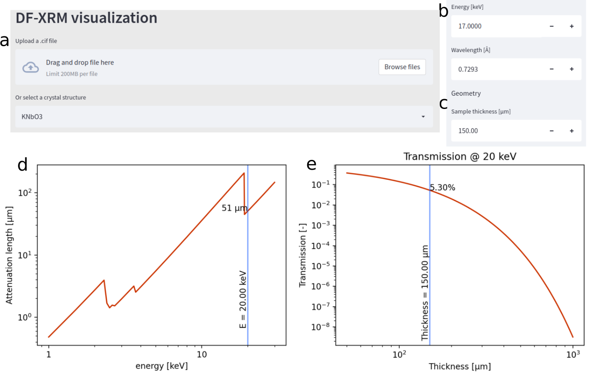
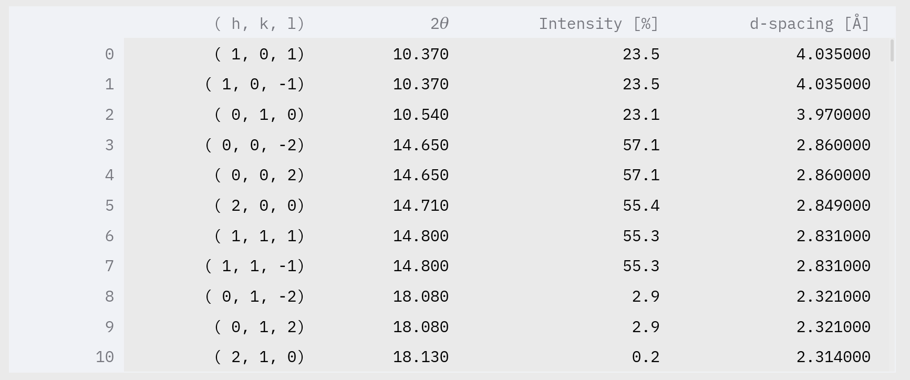

# DF-XRM_viz
Visualization of DF-XRM, made to be hosted at https://trygvrad-df-xrm-viz-df-xrm-vis-streamlit-91mzhk.streamlit.app/

You may run a standalone version by using streamlit locally by calling
```
streamlit run DF-XRM_vis_streamlit.py
```
or run the jupyter example.

# Usage

Sample absorption
---------------------------

Uploading a `.cif` file to `DF-XRM_vis` (Fig. 1a) `DF-XRM_vis` will plot the attenuation length with respect to the energy (Fig. 1d), and plot the transmission with respect to the sample thickness (Fig. 1e).

A handful of crystal-structures are available from the dropdown menu for easy access (as shown in the example).



The selected X-ray energy can then be changed (Fig. 1b, in keV or Å), and
the thickness of the sample can be changed (Fig. 1c).

This gives an immediate assessment of the flux exiting the sample, thus determins the viability of utilizing the sample for DF-XRM.

Considering Q-vectors
---------------------

Based on the provided `.cif` file and chosen wavelength, `DF-XRM_vis` will provide a table of available reflections, their scattering angle and *d*-spacing.



A suitable reflection, as allowed by the instrument, can then be chosen. `DF-XRM_vis` will automatically select the brightest reflection as an initial guess.

Crystal-sample-instrument orientation
-------------------------------------

A 3d rendering of the experimental conditions will then be generated based on an educated guess of sample facets. The user may then change the sample facets using real or reciprocal lattice vectors.

The rendering shows the required alignment of the crystal at to fulfill the selected reflection. Users may freely rotate the rendering in three dimensional space. The rendering consists of 4 parts:

1. The sample, annotated with the dimensions along the differnt axes.

2. The crystal structure, shown in the orientation determined by the scattering condition and and in complience with the crystallographic axes of the sample.

3. The beam, lens, and scattered beam.

4. The goiniometer stage, annotated with the angles of rotation.


Example visualization showing an x-cut LiNbO$_3$ wafer, aligned on the (1,-1,2) (brightest) reflection.

Rendering the sample with realistic dimensions makes it easier to ensure that samples are positioned with the intended orientation during the experiment, and helps visualize past experiments. 

Showing the crystal structure together with the sample geometry ensures that the relationship between the crystal lattice and sample geometry is correct. The rendering intentionally uses a parallel projection. 
This makes it easier to compare the crystal axes to the axes of the sample. 

By showing the beam in the rendering, the intersection between the beam and sample can be understood. The detector image in DF-XRM is a projection of the intersection between the beam and sample, so that a rendering of this intersection is useful when inspecting DF-XRM images. 

The goiniometer position is also shown. For large angles of $\phi$, such as shown here, it is advised to build a custom sample holder to hold the sample prior to the experiment. For smaller angles, the values presented in `DF-XRM_vis` may be directly applied to the instrument as part of the alignment procedure.


Special thanks to Dan Porter for developing https://github.com/DanPorter/Dans_Diffraction which is here used to read .cif fiels. 

This work is published in the Journal of Open Source Software (JOSS)
---------------------------------------------------------------------
Markdown:
[](https://doi.org/10.21105/joss.05177)
