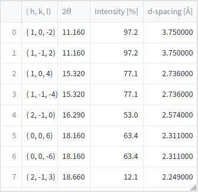

# Summary
`DF-XRM_vis` is a visualization tool to aid in planning, execution, and data analysis of dark-field X-ray microscopy experiments.
The toolkit is built in python and has a streamlit interface, as well as a jupyterlab example. The highlight of the toolkit is generating 3D models of experimental geometry, that are rendered together with the unit cell of the material.
As the streamlit application is hosted on a publicly available address, the toolkit is available also to researchers without programming experience.

# Statement of need

Advances in X-ray brilliance and optics have recently led to the development of Bragg scanning probe X-ray microscopy [@chahine2014imaging], Bragg coherent diffraction imaging [@shi2022applicability], Bragg X-ray ptychography [@pfeiffer2018x] and dark-field X-ray microscopy (DF-XRM) [@simons2015dark].
Bragg diffraction is scattering from crystallographic planes, and Bragg diffraction occurs due to interference along specific directions, requiring precise alignment of the sample. 
A change in the scattering angle or scattering direction corresponds directly to strain or rotation of the crystal lattice.
Classical X-ray diffraction techniques allow researchers to describe average strain states, while the aforementioned microscopy techniques improve upon this to give localized strain information, which provides unprecedented detail to describe the relationship between internal strain and material properties.
Performing an X-ray microscopy experiment requires aligning the sample to the Bragg condition and relating this to the real-space geometry of the sample.
This is of particular importance for DF-XRM, as the imaging plane of the crystal is not along a crystallographic plane, but instead can be at any orientation to the crystal.
For DF-XRM, aligning to the Bragg condition involves rotating the sample so that the X-ray beam enters the sample in the correct crystallographic direction, and then positioning the lens and detector in the path of the diffracted beam.
As a technique used at synchrotron and X-ray free electron laser facilities, all DF-XRM experiments involve a team of external scientists in collaboration with scientists working at the X-ray facility.
Communication of the experimental geometry is key to a successful experiment, both during experimental planning, execution, and subsequent data analysis.
However, communication of 3D geometry remains a significant challenge, particularly when communicating online.

`DF-XRM_vis` is a web app for visualizing the 3D geometry involved in a DF-XRM experiment.
As the geometric requirements of Bragg diffraction are strict, a description of the sample is sufficient to calculate the required geometry for any given Bragg reflection.
In addition to visualizing the geometry, `DF-XRM_vis` helps evaluate feasibility by displaying the sample attenuation and intensity of various Bragg reflections, which together predicts the signal-to-noise ratio.

# Features

`DF-XRM_vis` is designed to provide researchers with a maximum insight while requiring minimal input. Upon uploading a Crystallographic Information File (`.cif` file), the user is presented with plots of the attenuation length and transmission.
The former is used to identify a suitable wavelength, while the latter show how thin the sample must be in order for the experiment to be feasible.
Blue bars are added, indicating the selected wavelength and sample thickness, both of which can be tuned.
A default value of 17 keV is provided for the X-ray energy. This energy is suitable for Be lenses, and is typically used at the DF-XRM beamline at the European Synchrotron Radiation Facility (ESRF) if the absorption peaks of the material do not dictate a different choice.
A default value of 150 µm is set for the thickness.
An example is shown in \autoref{fig:abs}.

A list of possible Bragg reflections is also shown, together with the relative intensity that can be expected in DF-XRM (\autoref{fig:abs}).
We note that the intensity expected in DF-XRM is not the same as the intensity in a powder diffraction experiment, where intensity from symmetry-equivalent reflections are summed.
The brightest reflection is automatically selected, as a bright reflection is desirable in the absence of other considerations.

Following the table is a 3D visualization of the geometry.
The visualization makes an initial guess that the selected scattering vector defines "up" in the sample.
This is a reasonable assumption in many cases, but the option is provided to specify a different orientation using orthogonal facets.
Facets are described using Miller indices, and both reciprocal space lattice vectors (h,k,l), or real space lattice vectors [u,v,w] are accepted.
The visualization includes a unit cell of the material, which allows researchers to easily connect the direction in which they measure strain, and relate this to the plane defined by the incoming beam (imaging plane).
A parallel projection is used to facilitate easy comparison of angles in the figure.
A visualization of alignment of LiNbO$_3$ is shown in \autoref{fig:3d}.

Finally, `DF-XRM_vis` may show the position of the lens.
This feature was requested by beamline scientists at the European synchrotron radiation facility (ESRF), which uses a lensbox consisting of 88 Be lenses.
To obtain an image in the microscope the lensbox must be positioned correctly, but simple optical considerations, approximating the lensbox as a thin lens, do not give a satisfying answer. 
`DF-XRM_vis` considers each lens independently and uses an iterative algorithm to optimize the position of the the lensbox.
Each lens has a focusing power that depends on the wavelength, and this is handled automatically based on the wavelength already chosen by the user. 
The plot for positioning the lensbox is primarily intended to ease alignment of the instrument. An example is shown in \autoref{fig:lens}.
The lensbox configuration is implemented as a `.toml` file with a custom file ending, and documentation for writing a new configuration is included in the example file for the ESRF lensbox.

A link is provided to generate a pdf with the current details shown in the app. This functionality is intended for inclusion in the logbook of an ongoing experiment.

# Comparison to other tools

The calculation of absorption spectra can be handled by other web apps or desktop applications, while the calculation of diffraction peaks is commonly done by desktop applications. 
`DF-XRM_vis` expands upon previous work by providing multiple features in a single package with minimal input.
Furthermore, the 3D visualization, is a unique feature of `DF-XRM_vis` specifically tailored to then needs of the DF-XRM community.
As for the lens alignment, there are other tools that can calculate the focal power of a lensbox for X-rays, but a large number of parameters must be specified (lens material, wavelength, position of lenslets, radius of curvature of each lenslet, etc.).
Bundling the lens configuration into the same web app means that fewer parameters must be entered, and the use of a `.toml` file for the lens configuration greatly simplifies the user experience.

# Outlook

This tool is built initially for DF-XRM, and therefore includes the option of visualizing the lens specific to this technique. Specific options relating to other microscopy techniques based on Bragg diffraction may be implemented in the future.
We also note that the first report of DF-XRM at the European Synchrotron Radiation Facility was published in 2015 [@simons2015dark].
DF-XRM has since been implemented at the Linac Coherent Light Source (LCLS) [@holstad2022real], the Advanced light Source [@qiao2020large], and there have been as-of-yet unpublished activities also at other X-ray sources.

# Acknowledgements

`DF-XRM_vis` relies upon the python package Dans_Diffraction [@dan_porter_2020_3859501] to read `.cif` files and identify Bragg reflections. Matplotlib [@Hunter:2007] is used for 2d graphics, while plotly [@plotly] is used for 3D visualization. The author acknowledges funding from the European
Union’s Horizon 2020 research and innovation program under the Marie Skłodowska-Curie
grant agreement No 899987.

# References
